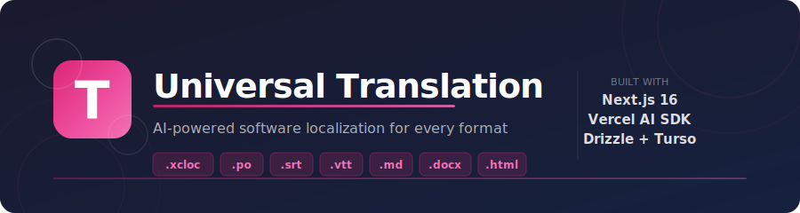

<p align="center">
  
</p>

**Universal Translation** is an AI-powered software localization platform. Upload any translation file, get context-aware, terminology-consistent translations in seconds, and export back to the original format — all in the browser.

## Features

- **Multi-format support** — `.xcloc` (Xcode String Catalogs), `.po`/`.pot` (Gettext), `.srt` (SubRip subtitles), `.vtt` (WebVTT), `.md` (Markdown), `.txt` (plain text), `.docx`/`.html` (documents)
- **AI-powered translation** — LLM-driven, context-aware translations via Vercel AI SDK
- **Glossary & terminology consistency** — custom glossary enforced across all translations
- **Version history** — every save creates a snapshot; browse and restore previous versions
- **Cloud projects** — save projects to the cloud and resume editing from any device
- **Internationalized UI** — English and Chinese interfaces via next-intl

## Tech Stack

| Layer | Technology |
|---|---|
| Framework | [Next.js 16](https://nextjs.org) (App Router, React 19) |
| AI | [Vercel AI SDK 6](https://sdk.vercel.ai) |
| Database | [Turso](https://turso.tech) (libSQL) + [Drizzle ORM](https://orm.drizzle.team) |
| Auth | [Auth.js v5](https://authjs.dev) (OAuth) |
| Styling | Tailwind CSS v4 + shadcn/ui |
| Package manager | [Bun](https://bun.sh) |

## Getting Started

### Prerequisites

- [Bun](https://bun.sh) ≥ 1.0
- A [Turso](https://turso.tech) database (or compatible libSQL instance)
- OAuth provider credentials for Auth.js

### Installation

```bash
# Install dependencies
bun install

# Push the database schema
bun run db:push

# Start the development server
bun run dev
```

Open [http://localhost:3000](http://localhost:3000) to see the app.

### Environment Variables

Copy `.env.example` to `.env.local` and fill in your credentials:

| Variable | Description |
|---|---|
| `TURSO_DATABASE_URL` | libSQL connection URL |
| `TURSO_AUTH_TOKEN` | Turso authentication token |
| `AUTH_SECRET` | Auth.js secret (run `openssl rand -hex 32`) |
| `AUTH_*` | OAuth provider credentials |

## Available Scripts

| Script | Description |
|---|---|
| `bun run dev` | Start the Next.js development server |
| `bun run build` | Build for production (runs `db:push` first) |
| `bun run start` | Start the production server |
| `bun run lint` | Run ESLint |
| `bun run test` | Run unit tests with Vitest |
| `bun run e2e` | Run end-to-end tests with Playwright |
| `bun run db:generate` | Generate Drizzle migration files |
| `bun run db:push` | Push schema changes to the database |

## Project Structure

```
app/                  # Next.js App Router pages & server actions
components/           # Shared React components (UI + landing page)
lib/
  translation/        # Core translation engine
    client.ts         # TranslationClient interface
    detection.ts      # Format detection (confidence scoring)
    registry.ts       # Registry & resolution
    xcloc/            # Xcode .xcloc format
    po/               # Gettext .po/.pot format
    srt/              # SubRip .srt subtitles
    vtt/              # WebVTT .vtt subtitles
    document/         # .docx / .txt documents
    html/             # HTML files
    lyrics/           # Lyrics format
  db/                 # Drizzle schema & database client
messages/             # i18n translation files (en.po, zh.po)
docs/                 # Architecture and developer documentation
e2e/                  # Playwright end-to-end tests
__tests__/            # Vitest unit tests
```

## Documentation

- [Translation System Architecture](./docs/translation/architecture.md)
- [Interface Reference](./docs/translation/interface-reference.md)
- [Upload Flow](./docs/translation/upload-flow.md)
- [Adding a New Format](./docs/translation/adding-a-format.md)

## License

[MIT](./LICENSE)
